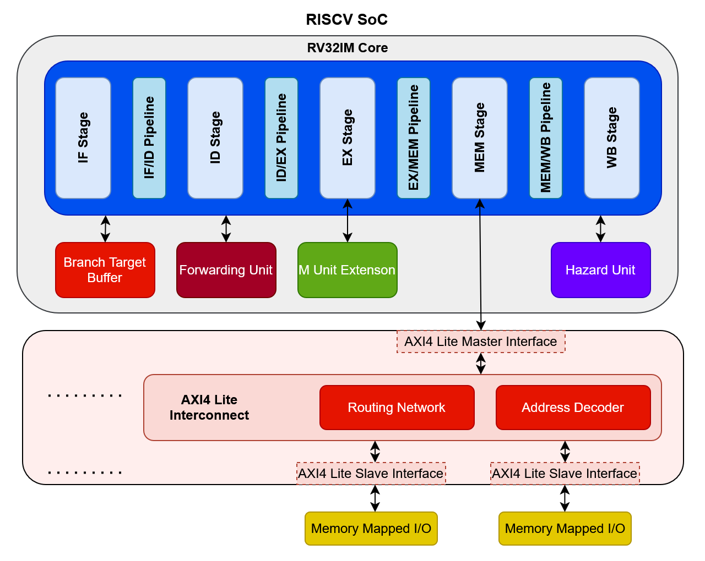
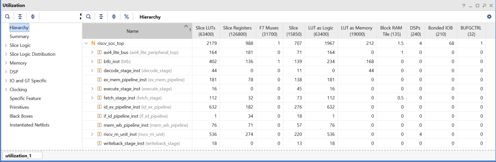
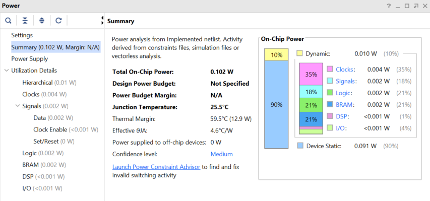

# RISCV RV32IM AXI4-Lite SoC

This repository contains the implementation and verification of a 5-stage pipelined RISC-V RV32IM processor as part of a AXI4-Lite based SoC.
The design supports the base **RV32I** instruction set along with **M-extension** (multiplication and division). It also has a hazard unit for flushing/stalling the pipeline, a forwarding unit to prevent data hazards, and a branch target buffer for branch prediction. The design supports a single Master and multiple slaves over an AXI4-Lite interconnect.

---

## 📑 Table of Contents

* [Block Diagram](#-block-diagram)
* [Repository Structure](#-repository-structure)
* [Pipeline Stages](#-pipeline-stages)
* [Supporting Modules](#-supporting-modules)
* [Supported Instructions](#-supported-instructions)
* [Performance Improvements](#-performance-improvements)
  * [M-Unit vs Shift-Add Multiply](#m-unit-vs-shift-add-multiply)
  * [BTB Speedup](#btb-speedup)
* [Timing](#-timing)
* [FPGA Resource Utilization](#-fpga-resource-utilization)
* [Power Consumption](#-power-consumption)
* [How to Run](#-how-to-run)
* [Adding Peripherals](#-adding-peripherals)
* [Test Example](#-test-example)
* [Future Work](#-future-work)
* [References](#-references)
* [License](#-license)
* [Contributions](#-contributions)

---

## 📊 Block Diagram



---

## 📂 Repository Structure

```
src/                 
  ├── fetch_stage/
  ├── decode_stage/
  ├── execute_stage/
  ├── mem_stage/
  ├── writeback_stage/ 
  ├── pipeline_registers/
  ├── branch_target_buffer/
  ├── m_unit_extension/ 
  ├── axi4_lite/
  ├── axi4_lite_interconnect/ 
  ├── peripherals/ 
  ├── axi4_lite_peripheral_top.sv 
  ├── forwarding_unit.v
  ├── hazard_unit.v
  ├── riscv_soc_top.v
  └── defines.vh
tb/                   Testbenches
programs/             Sample RISC-V programs
imgs/                 Block diagrams
LICENSE
README.md             Main documentation
```

---

## 🔄 Pipeline Stages

Each stage has its own folder with detailed documentation:

* [Instruction Fetch (IF)](src/fetch_stage/README.md)
* [Instruction Decode (ID)](src/decode_stage/README.md)
* [Execute (EX)](src/execute_stage/README.md)
* [Memory Access (MEM)](src/mem_stage/README.md)
* [Write Back (WB)](src/writeback_stage/README.md)

### Special Notes

* In **IF/ID**, no extra instruction register is needed (instruction memory has 1-cycle latency).
* Some pipelines have flush and enable signals to stall or flush the instructions. [Click](src/pipeline_registers/README.md) for more detals.
* Unused instruction memory addresses are not initalized to anything to avoid reset overhead.
* Insertion of AXI4 slave makes memory-mapped access take atleast 3 cycles whereas having data memory directly in mem-stage takes 1 cycle.

---

## 🧩 Supporting Modules

* [Branch Target Buffer (BTB)](src/branch_target_buffer/README.md) – simple branch predictor with update mechanism.
* [M Unit](src/m_unit_extension/README.md) – RV32M extension, hardware multiplier/divider.
* [AXI4 Lite](src/axi4_lite/README.md) – Contrains Master and Slave wrappers used in interconnect.
* [AXI4 Lite Interconnect](src/axi4_lite_interconnect/README.md) – Interconnect structure supporting Single Master - Multiple Slave configuration.
* [Forwarding Unit](src/README.md) – resolves data hazards by forwarding from MEM/WB.
* [Hazard Unit](src/README.md) – detects load-use hazards, handles pipeline stalls and flushes.

---

## 📑 Supported Instructions
The list of supported instructions by the processor is listed below. These are all the user instructions from rv32im.


## 📊 RV32IM Core Connections


## ⚡ Performance Improvements

### M-Unit vs Shift-Add Multiply

* Traditional **shift-add multiply/shift-sub divide** requires **32 iterations** for a 32-bit multiply/divide.
* The dedicated **M-unit** executes multiplication in **1 cycles** and for division a maximum of **27 cycle**. This results in a **~21x speedup** for multiplication and **~9x speedup** for divison.
* This reduces CPI drastically for multiplication-heavy programs (e.g., matrix multiply).

| Test         | SW Implementation | HW Extension | Improvement | Speedup |
| ------------ | ----------------- | ------------ | ----------- | ------- |
| Multiply     |        231        |      10      |    95.7 %   |  21.3x  |
| Divide       |        350        |      41      |    88.3 %   |  8.54x  |

See [Mul/Div Tests](tb/README.md#test-categories) for more details

### BTB Speedup

* Without BTB: Every taken branch incurs a **2-cycle penalty**.
* With BTB: Correctly predicted branches avoid stalls. The improvement is workload dependant but on average for different test cases we can observe a **\~20–40%** improvement.

| Test               | Without BTB (Cycles) | With BTB (Cycles) | Improvement |
| ------------------ | -------------------- |------------------ |------------ |
| Forward Branch     |         45           |        33         |    26.7 %   |
| Long Forward Branch|         133          |        77         |    42.1 %   |
| Conditional Branch |         86           |        60         |    30.2 %   |
| Nested Branch      |         147          |        103        |    29.9 %   |
| Alternating Branch |         165          |        129        |    21.8 %   |

See [BTB Tests](tb/README.md#test-categories) for more details

---

## ⏱ Timing

* Maximum clock frequency achieved: **75 MHz** on Nexys A7 (XC7A100T).
* Critical path: Execute stage (ALU + forwarding logic + PC Jump Address).


---

## 📊 FPGA Resource Utilization

* The results are Post-Implementation results for Nexys A7 (XC7A100T) at 75MHz.

| Resource        | Utilization |
| --------------- | ----------- |
| Slice LUTs      | 2179        |
| Slice Registers | 988         |
| BRAM            | 1.5         |
| DSP Blocks      | 4           |



---

### ⚡ Power Consumption

* **Dynamic Power:** 0.010 W (due to switching activity during operation)
* **Static Power:** 0.091 W (leakage and idle power)
* **Total Estimated Power:** 0.102 W

💡 *These numbers come from Vivado’s post-implementation power report at 75 MHz.*



---

## 📜 How to Run

1. Clone the repo:

   ```bash
   git clone https://github.com/TalhaIsrar/RISCV-RV32IM-AXI4-Lite-SoC
   ```
2. Open **Vivado** project and add files from `src/` and `tb/`.
3. Compile RISC-V test programs from `programs/` and load them into instruction memory.

---

## 🧩 Adding Peripherals

1. In file [axi4_lite_addr_map_pkg](src/axi4_lite_interconnect/axi4_lite_addr_map_pkg.sv) increment the slave number and add the appropriate base addr and mask.
2. In file [axi4_lite_peripheral_top](src/axi4_lite_peripheral_top.sv) add your new slave at bottom and connect the apporopriate signals from interconnect.
3. Make sure data and address widths match, the core is 32 bit based.

---

## 📊 Test Example
- The processor was tested using a variety of test assembly codes. To further test the processor real life examples were used. These can be found at [Example Programs](programs/tests/examples) with their [Results](imgs/tests/programs). One of these examples is below

### Modular Exponentiation 
For stressing **forwarding, hazards, BTB, and the M-extension**, a **Modular Exponentiation** program is ideal. It involves:

* **Multiplications** → triggers your **M-unit**
* **Conditional branches in loops** → triggers **BTB prediction**
* **Dependent instructions** → triggers **forwarding and hazards**
* **Nested loops and iterative computation** → ensures pipeline stalls occur if not handled

$$
result = (a^b) \mod m
$$

The result is saved in x7 register

### Example Test Numbers:

* Base `a = 7`
* Exponent `b = 13`
* Modulus `m = 20`

**Expected final result**:

$$
7^{13} \mod 20 = 7
$$


## 📌 Future Work

* Support for CSR instructions
* More advanced branch predictors (gshare)
* Memory-mapped I/O support
* UVM-based verification

---


## 🔗 References

* [RISC-V ISA Manual](https://riscv.org/technical/specifications/)
* [AMBA AXI Porotocl Specification](https://developer.arm.com/documentation/ihi0022/latest)
* [AXI4 Lite Interface](https://www.realdigital.org/doc/a9fee931f7a172423e1ba73f66ca4081)
* \[Computer Organization and Design RISC-V Edition – Patterson & Hennessy]

---

## 📄 License

This project is released under the MIT License. See the [LICENSE](LICENSE) file for details.

---

## 🤝 Contributions

Contributions, suggestions, and issue reports are welcome! Feel free to fork and open pull requests.

---

*Created by Talha Israr*  
